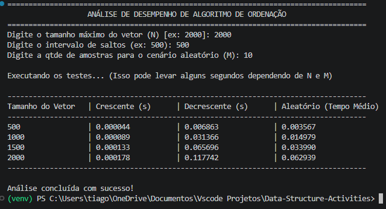

# RELATÓRIO DE ATIVIDADE PRÁTICA / ESTUDO INDEPENDENTE

**Disciplina:** Estrutura de Dados  
**Estudante(s):** [Seu Nome Completo]  
**Atividade:** Implementação e Análise de Desempenho de Algoritmo de Ordenação  
**Data de Entrega:** [DD/MM/AAAA]  

---

## 1. Descrição da Solução

Desenvolvimento de um programa em Python para analisar o desempenho de um algoritmo de ordenação (ex: Insertion Sort). O sistema recebe como entrada o tamanho máximo do vetor (N), o intervalo de saltos e a quantidade de amostragens (M). Para cada tamanho de vetor, o algoritmo processa três cenários distintos para avaliar o impacto da disposição inicial dos dados no custo de processamento:
- **Crescente:** Vetor previamente ordenado do menor para o maior.
- **Decrescente:** Vetor ordenado de forma invertida (do maior para o menor).
- **Aleatório:** Vetor com números embaralhados (gera M vetores, ordena e calcula a média do tempo de execução).
Ao final, o programa exibe no console uma tabela formatada comparando os tempos de execução aferidos.

## 2. Instruções de Compilação e Execução

* **Linguagem / Ambiente:** Python 3.13.3
* **Como executar:** Abra o terminal na pasta onde o código-fonte está salvo e digite `python main.py`. O programa rodará diretamente no console, solicitando as entradas das variáveis N, Salto e M.

## 3. Casos de Teste e Evidências de Funcionamento

* **Teste 1:** Execução com N = 2000, salto de 500 em 500, e M = 5 amostras para o cenário aleatório.
  * **Resultado esperado:** O programa processa os testes e imprime uma tabela de 4 linhas consolidadas mostrando os tempos crescentes conforme o tamanho do vetor aumenta.
  * **Resultado obtido:** Funcionou conforme o esperado. Os tempos refletiram o comportamento teórico do algoritmo (ex: cenário decrescente teve o maior tempo de processamento).

## 4. Referências Consultadas

* Documentação oficial do Python
* Gemini

---

## 7. Declaração de Uso de Inteligência Artificial

* **Ferramenta utilizada:** Google Gemini
* **Finalidade de sua utilização:** Suporte na estruturação do código em Python, implementação da lógica de aferição de tempo (benchmark) e formatação tabular da saída no console.
* **Etapas da atividade em que foi empregada:** Fase de desenvolvimento do script de automação dos testes e elaboração do esqueleto inicial deste relatório.
* **Procedimentos adotados para verificar as informações:** O código gerado foi revisado, lido linha a linha e executado no terminal local para garantir que a lógica de temporização (`time.perf_counter()`) não interferisse no algoritmo em si.
* **Erros, limitações ou inconsistências identificados:** Não houve inconsistência na lógica algorítmica, apenas a necessidade de formatar adequadamente as colunas da tabela impressa para que não quebrassem no console com vetores grandes.
* **Alterações realizadas pelo estudante:** Adaptação da função de ordenação original desenvolvida em sala de aula para o script de testes e ajustes na formatação do relatório final.
* **Indicação das partes do trabalho que receberam apoio da ferramenta:** Estrutura base de execução (função `main`), biblioteca `time` e marcação markdown do relatório.